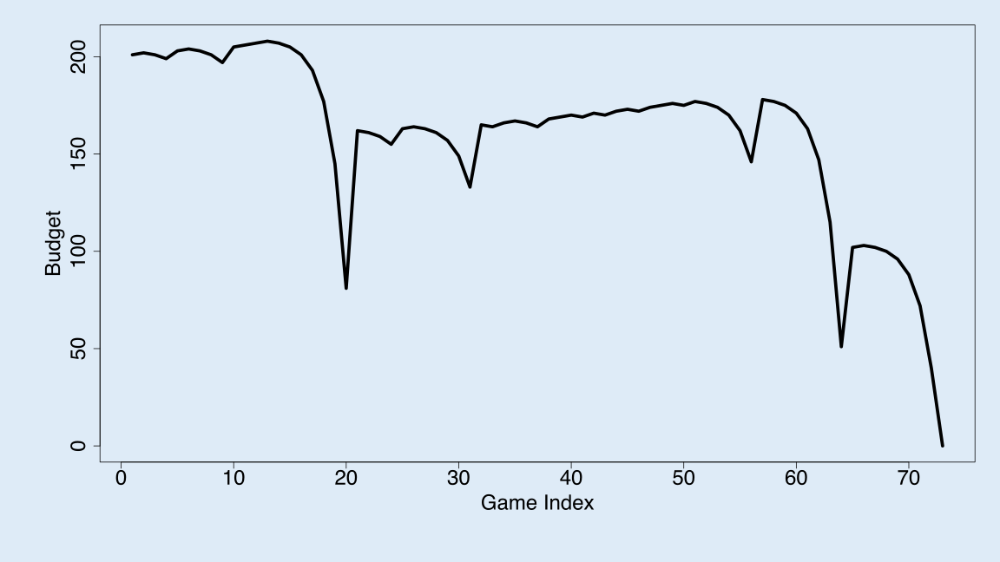
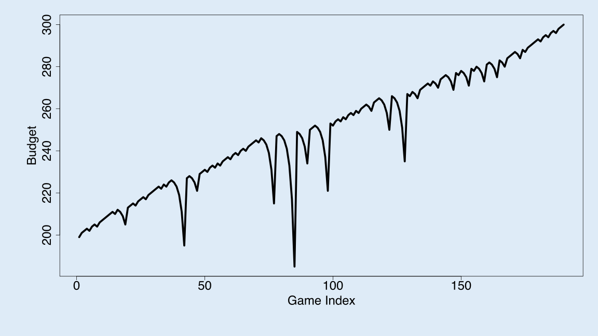

Reference: https://github.com/thomasgstewart/data-science-5620-Fall-2021/blob/master/deliverables/01-roulette.md


```{r}
single_spin <- function(){
  possible_outcomes <- c(rep("red",18), rep("black",18), rep("green",2))
  sample(possible_outcomes, 1)
}


martingale_wager <- function(
  previous_wager
  , previous_outcome
  , max_wager
  , current_budget
){
  if(previous_outcome == "red") return(1)
  min(2*previous_wager, max_wager, current_budget)
}

one_play <- function(previous_ledger_entry, max_wager){
  # Create a copy of the input object that will become the output object
  out <- previous_ledger_entry
  out[1, "game_index"] <- previous_ledger_entry[1, "game_index"] + 1
  out[1, "starting_budget"] <- previous_ledger_entry[1, "ending_budget"]
  out[1, "wager"] <- martingale_wager(
    previous_wager = previous_ledger_entry[1, "wager"]
    , previous_outcome = previous_ledger_entry[1, "outcome"]
    , max_wager = max_wager
    , current_budget = out[1, "starting_budget"]
  )
  out[1, "outcome"] <- single_spin()
  out[1, "ending_budget"] <- out[1, "starting_budget"] + 
    ifelse(out[1, "outcome"] == "red", +1, -1)*out[1, "wager"]
  return(out)
}

one_series <- function(
  max_games, starting_budget, winning_threshold, max_wager
){
  # Initialize ledger
  ledger <- data.frame(
      game_index = 0:max_games
    , starting_budget = NA_integer_
    , wager = NA_integer_
    , outcome = NA_character_
    , ending_budget = NA_integer_
  )
  ledger[1, "wager"] <- 1
  ledger[1, "outcome"] <- "red"
  ledger[1, "ending_budget"] <- starting_budget
  for(i in 2:nrow(ledger)){
    #browser()
    ledger[i,] <- one_play(ledger[i-1,], max_wager)
    if(stopping_rule(ledger[i,], winning_threshold)) break
  }
  # Return non-empty portion of ledger
  ledger[2:i, ]
}

stopping_rule <- function(
  ledger_entry
  , winning_threshold
){
  ending_budget <- ledger_entry[1, "ending_budget"]
  if(ending_budget <= 0) return(TRUE)
  if(ending_budget >= winning_threshold) return(TRUE)
  FALSE
}

profit <- function(ledger){
  n <- nrow(ledger)
  profit <- ledger[n, "ending_budget"] - ledger[1, "starting_budget"]
  return(profit)
}
require(magrittr)
require (dplyr)

svg(filename = "loser.svg", width=16, height =9)
par(cex.axis=2, cex.lab = 2, mar = c(8,8,2,2), bg = rgb(222, 235, 247, max = 255))
set.seed(1)
ledger <- one_series(200,200,300,500)
plot(ledger[,c(1,5)], type = "l", lwd = 5, xlab = "Game Index", ylab = "Budget")


svg(filename = "winner.svg", width=16, height =9)
par(cex.axis=2, cex.lab = 2, mar = c(8,8,2,2), bg = rgb(222, 235, 247, max = 255))
set.seed(2)
l2 <- one_series(200,200,300,500)
plot(l2[,c(1,5)], type = "l", lwd = 5, xlab = "Game Index", ylab = "Budget")

```


***Introduction***
<p>&emsp;As the purpose of the article, We try to use data science tech to analyze a class roulette strategy, Martingale strategy. As we known that a roulette table composed of 38 (or 37) evenly sized pockets on a wheel, including red, black, or green pockets. The payout for a bet on black is 1 dollar for each wagered. Generally, for each sub sequence, no matter how many losses happened before the final red win, the win wager will not only offset the previous lost, but also will earn 1 dollar. To know whether it will work, as a data scientist,applying computer simulation will help us understand the scenario.</p>
 
***Background and Operating Characters*** 
<p>&emsp;To explain how the computer does simulation, first of all, we need think over key features in the whole procedure by understating the operating characteristics in the strategy. Generally, there are two processes, the single spin of the wheel and martingale wager rule. combing  two processing, we could create a function to replicate series of plays. To test key properties of the interest, profit or loss, we need applying stop rule for series of plays. Base on the background, we have three stopping rules:</p>
       # three stopping rules
        - The player has W dollars, which are 200 dollar starting budgets and 100 dollar winnings
        - The player goes bankrupt
        - The player completes L wagers (or plays)
      
<p>&emsp;With the clear operating characteristics, there are four Parameters:</p>
       # four Parameters
      |***Parameter*** |***Description***                 | ***Starting value***
      |----------------|--------------------------------- | --------------------
      |B               |Starting budget                   | $200
      |W               |Maximum wager                     | $300 (Starting budget + $100 winnings)
      |L               |Maximum number of plays           | 1000 plays
      |M               |Winning threshold for stopping    | $100     
      
***Simulation Methods***   
&ensp;***Simulation Function for Spin of the Wheel***
<p>&emsp;Now, we could start the computer simulation step by step. First, the computer simulation helps us get a random solution of the single spin of the wheel, as we apply the following code:</p>
      # Spin of the wheel
      red <- rbinom(1,1,18/38) 
      
      or 
      
      single_spin <- function(){
      possible_outcomes <- c(rep("red",18), rep("black",18), rep("green",2))
      sample(possible_outcomes, 1)
      }
<p>&emsp;The code allow us to receive a random spin result as the red probability is 18 out of 38.

&ensp;***Simulation Function for Martingale Wager Rule***
<p>&emsp;The Next task is to consider the stimulation of martingale wager rule. To complete the whole procedures, we need find the  previous outcome. If the previous outcome negative, we need to know previous wager, max wager, and current budget as well. Then, we are able to calculate martingale wager. For martingale wager, if the outcome is <font  color=Red>"Red"</font>, the wager will be one, otherwise it will be the minimum amount between twice of the previous wage, max wage, and the current budget. Here, we have two codes solutions:</p>
      # The Single Martingale Wager
      {
      proposed_wager <- ifelse(state$previous_win, 1, 2*state$previous_wager)
      wager <- min(proposed_wager, state$M, state$B)
      }
      
      or
      
      {
      if(previous_outcome == "red") return(1)
      min(2*previous_wager, max_wager, current_budget)
      }
<p>&emsp;Now, with the logical, we are going to put all four inputs into the martingale wager rule and create the function:</p>
       # The Single Martingale Wager Function
        state$plays <- state$plays + 1
        state$previous_wager <- wager
        if(red){
            # WIN
          state$B <- state$B + wager
          state$previous_win <- TRUE
        }else{
            # LOSE
          state$B <- state$B - wager
          state$previous_win <- FALSE
        }
        state
        }
        
        or 
      
        martingale_wager <- function(previous_wager, previous_outcome, max_wager, current_budget){
        if(previous_outcome == "red") return(1)
        min(2*previous_wager, max_wager, current_budget)
        }
        
&ensp;***One Play Simulation Function***  
<p>&emsp; Before using commuter simulation to implement Martingale Strategy over a long series of plays, we use the ledger to represent each play of the game. Different from previous stimulation outcomes,we need apply data frame at one-play stimulation, since one play will includes game indexes, start budgets, wagers based on the wheel spin outcome, and the ending budgets. For each play, we know start budgets will be equal to previous ending budgets, outcomes will be determined by the spin of the wheel's simulation, the wager will be derived base on the outcome, and ending budgets equal the sum of starting budgets and wagers. Here are two codes responses: </p>
        #One Play Simulation Function
        
        one_play <- function(state){
        # Wager
        proposed_wager <- ifelse(state$previous_win, 1, 2*state$previous_wager)
        wager <- min(proposed_wager, state$M, state$B)
        # Spin of the wheel
        red <- rbinom(1,1,18/38)
        # Update state
        state$plays <- state$plays + 1
        state$previous_wager <- wager
        if(red){
          # WIN
          state$B <- state$B + wager
          state$previous_win <- TRUE
        }else{
          # LOSE
          state$B <- state$B - wager
          state$previous_win <- FALSE
        }
          state
        }
        
        or
        
        one_play <- function(previous_ledger_entry, max_wager){
          # Create a copy of the input object that will become the output object
        out <- previous_ledger_entry
        out[1, "game_index"] <- previous_ledger_entry[1, "game_index"] + 1
        out[1, "starting_budget"] <- previous_ledger_entry[1, "ending_budget"]
        out[1, "wager"] <- martingale_wager(
          previous_wager = previous_ledger_entry[1, "wager"]
          , previous_outcome = previous_ledger_entry[1, "outcome"]
          , max_wager = max_wager
          , current_budget = out[1, "starting_budget"]
        )
        out[1, "outcome"] <- single_spin()
        out[1, "ending_budget"] <- out[1, "starting_budget"] + 
        ifelse(out[1, "outcome"] == "red", +1, -1)*out[1, "wager"]
        return(out)
        }
<p>&emsp;The first code solutions is a stimulation function combination of the previous three parts. The second code solution demonstrates the whole idea of ledger, representing the reflection of one play 

<p>&ensp;***Series of Plays Simulation***   
<p>&emsp;To get the sequence of plays, we need to simulate series of plays. Generally, it is duplicated plays based one one-play simulation. But, the initial play has some differences. First, to mimic the round 1 correctly, we needs setup the game 0 as the initial play. Then, we will apply For loop function, allowing the computer simulate tons of play round until the play meet stop rules, which we will talk later. Here we have two codes solutions.</p>
        one_series <- function(
        B = 200
        , W = 300
        , L = 1000
        , M = 100
        ){

        # initial state
        state <- list(
          B = B
        , W = W
        , L = L
        , M = M
        , plays = 0
        , previous_wager = 0
        , previous_win = TRUE
        )
  
        # vector to store budget over series of plays
          budget <- rep(NA, L)
  
        # For loop of plays
        for(i in 1:L){
          new_state <- state %>% one_play
          budget[i] <- new_state$B
          if(new_state %>% stop_play){
            return(budget[1:i])
          }
          state <- new_state
        }
          budget    
        }

        or
          
        one_series <- function(
          max_games, starting_budget, winning_threshold, max_wager
        ){
        # Initialize ledger
        ledger <- data.frame(
             game_index = 0:max_games
           , starting_budget = NA_integer_
           , wager = NA_integer_
           , outcome = NA_character_
           , ending_budget = NA_integer_
        )
        ledger[1, "wager"] <- 1
        ledger[1, "outcome"] <- "red"
        ledger[1, "ending_budget"] <- starting_budget
        for(i in 2:nrow(ledger)){
          #browser()
          ledger[i,] <- one_play(ledger[i-1,], max_wager)
          if(stopping_rule(ledger[i,], winning_threshold)) break
            }
        # Return non-empty portion of ledger
        ledger[2:i, ]
        }
  

&ensp;***Stop Rules Function and Average Number of Plays before Stopping***  
<p>&emsp; While the one_series function has give us a clear function to achieve the ledger. but we sill need to setup a stop rules to finish one series from infinite. based on the parameter, we have three parameter.</p>
      - Maximum wager equals $300, earning $100 from $200 starting budget
      - Maximum number of plays is  1000
      - bankruptcy
<p>&emsp;Thus, we can have two code solutions here:</p>
      # Stopping rule
      stop_play <- function(state){
      if(state$B <= 0) return(TRUE)
      if(state$plays >= state$L) return(TRUE)
      if(state$B >= state$W) return(TRUE)
      FALSE
      }
      or 
      stopping_rule <- function(
      ledger_entry
      , winning_threshold
      ){
      ending_budget <- ledger_entry[1, "ending_budget"]
      if(ending_budget <= 0) return(TRUE)
      if(ending_budget >= winning_threshold) return(TRUE)
      FALSE
      }
<p>&emsp; With the stop rule function, the one series function will work functional.Furthermore, knowing when to stop, we can estimate the average number of plays before stopping. The first step is to find how to count the number of one series play. Thus, we can find the game index in the ledger, counting the ledger game index row to find the total number. Do not forget, the ledger includes N/A as the initial geame index. We need to remove the row before count. Finally I can have a codes:</p>
      #Count the number of run in one series play
      ledger <- one_series(200,200,300,500)
      as.numeric(count(na.omit(ledger,"game_index")))
<p>&emsp;Now, what we need is to create a stimulation so that 1000 players can play now. </p>

      running_time <- rep(NA, 1000)
      for(i in seq_along(running_time)){
      ledger <- one_series(200,200,300,500)   
      running_time[i] <-as.numeric(count(na.omit(ledger,"game_index")))
      }
      
      
      
<p>&emsp; This loop allow us have a data set include 1000 plays' runing times. To get the estimate avage ruing time, We can use mean function to find the average number: </p>
      mean(running_time)
<p>&emsp; Based on the simulation, we can estimate that the average number of plays before stopping will be:</p>
```{r}
#average number of plays before stopping

runing_time <- rep(NA, 1000)
for(i in seq_along(runing_time)){
ledger <- one_series(200,200,300,500)
runing_time[i] <-as.numeric(count(na.omit(ledger,"game_index")))
}

mean(runing_time)
```

##You should explain how you used computer simulation to calculate the average earnings of a gambler that uses this strategy. As part of the explanation, provide a figure (or a series of figures) that show how the gamblers earnings (or losses) evolve over a series of wagers at the roulette wheel. (The x-axis will be the wager number (or play number), the y-axis will be earnings.) The code below provides all the functions you’ll need to calculate average earnings.


&ensp;***Simulation for Earning and Loss***
<p>&emsp;Figuring out the profit is one major task. Generally, it is how much difference between the finally ending budget with the initial beginning budget. As we have already got the one_series function, we can have ledger information easily. Here is the code for profit calculation:</p>
      #profit function
      profit <- function(ledger){
      n <- nrow(ledger)
      profit <- ledger[n, "ending_budget"] - ledger[1, "starting_budget"]
      return(profit)
      }

<p>&emsp;Now, we have all necessary parts. The last thing we need do is let the whole simulation! here is the function code:</p>
       
        #Code 1:
        svg(filename = "loser.svg", width=16, height =9)
        par(cex.axis=2, cex.lab = 2, mar = c(8,8,2,2), bg = rgb(222, 235, 247, max = 255))
        set.seed(1)
        ledger <- one_series(200,200,300,500)
        plot(ledger[,c(1,5)], type = "l", lwd = 5, xlab = "Game Index", ylab = "Budget")
        dev.off()
        profit(ledger)

<p>&emsp;With the code, we may stimulate the loser solution. Here is the graph: </p>


    
    
<p>&emsp;In the graph, the total game index is 73. While, most of the tine, the player has a steady,but, with the bad luck, the game trend goes downside the strategy works in some way, but once the player have a large amount of loss in each sub-sequence, the player havs no budget to double the previous wager for the next round. </p>

<p>&emsp;To calulate the net earning, we can use profit(ledger). We can get:</p>
```{r}
profit(ledger)
```

<p>&emsp;To get the total running times before stop, we can useas.numeric(count(na.omit(ledger,"game_index"))). we get:</p>

```{r}
as.numeric(count(na.omit(ledger,"game_index")))

```
g
<p>&emsp;With following code, we could stimulate a loser solution. Here is the code: </p>

    vg(filename = "winner.svg", width=16, height =9)
    par(cex.axis=2, cex.lab = 2, mar = c(8,8,2,2), bg = rgb(222, 235, 247, max = 255))
    set.seed(2)
    l2 <- one_series(200,200,300,500)
    plot(l2[,c(1,5)], type = "l", lwd = 5, xlab = "Game Index", ylab = "Budget")
    dev.off()
<p>&emsp; The visible graph is here:</p>
  

<p>&emsp;In the graph, the total game index is way more than 190. This time, the player has a good luck. We can have a up forward trend here. the strategy works once the player has a large amount of win in each sub-sequence. While several loss-weighted sub-sequence happened, the player still have have enough ending budget to afford the double wager for next time.</p>

<p>&emsp;As the player stops running times with maximum wager, the profit here is $100.

<p>&emsp;To get the total running times before stop, we can useas.numeric(count(na.omit(l2,"game_index"))). we get:</p>

```{r} 
as.numeric(count(na.omit(l2,"game_index")))

```

<p>&emsp;Simple sample could not decide everything, we need to calculate the average earning of a gambler that uses this strayegy to do determine if it works. Thus we need a simulation function to repeat the games to get the answer. First, we need a simulation function:</p>
      # Simulation
      walk_out_money <- rep(NA, 10000)
      for(j in seq_along(walk_out_money)){
      walk_out_money[j] <- one_series(B = 200, W = 300, L = 1000, M = 100) %>% get_last
      }
<p>&emsp;In the function we need the finial walk_out_money test rep for 10000 time. for each time we follow the one_series function. As the answer will be stored in data set j. Now the find the average earning in 10000 times, we just need to calculate the mean of the data set j.</p>
      # Estimated earnings
        mean(walk_out_money - 200)
        
<p>&emsp;Based on the parameter, the computer simulate the average earning of a gambler based on 10000 players: 
```{r}
# Simulation
one_play <- function(state){
  
    # Wager
    proposed_wager <- ifelse(state$previous_win, 1, 2*state$previous_wager)
    wager <- min(proposed_wager, state$M, state$B)
    
    # Spin of the wheel
    red <- rbinom(1,1,18/38)
    
    # Update state
    state$plays <- state$plays + 1
    state$previous_wager <- wager
    if(red){
      # WIN
      state$B <- state$B + wager
      state$previous_win <- TRUE
    }else{
      # LOSE
      state$B <- state$B - wager
      state$previous_win <- FALSE
    }
  state
}


stop_play <- function(state){
  if(state$B <= 0) return(TRUE)
  if(state$plays >= state$L) return(TRUE)
  if(state$B >= state$W) return(TRUE)
  FALSE
}


one_series <- function(
    B = 200
  , W = 300
  , L = 1000
  , M = 100
){

  # initial state
  state <- list(
    B = B
  , W = W
  , L = L
  , M = M
  , plays = 0
  , previous_wager = 0
  , previous_win = TRUE
  )
  
  # vector to store budget over series of plays
  budget <- rep(NA, L)
  
  # For loop of plays
  for(i in 1:L){
    new_state <- state %>% one_play
    budget[i] <- new_state$B
    if(new_state %>% stop_play){
      return(budget[1:i])
    }
    state <- new_state
  }
  budget    
}

# helper function
get_last <- function(x) x[length(x)] 
walk_out_money <- rep(NA, 10000)
for(j in seq_along(walk_out_money)){
  walk_out_money[j] <- one_series(B = 200, W = 300, L = 1000, M = 100) %>% get_last
}

# Estimated earnings
mean(walk_out_money - 200)

```
<p>&emsp; Here is the related distribution.</p>

```{r}
# Walk out money distribution
hist(walk_out_money, breaks = 100)
```


<p>&emsp;As the walk ou money is only 0, bankruptcy, or 100, maximum, the computer simulate the estimated probability of walking out with extra cash will be:</p>
```{r}
# Estimated earnings
mean(walk_out_money > 200)
```


***Average earning impact based on a changing parameter***  
<p>&emsp;Changing a parameter will change the simulation solution. As we set the one series player function, and stop running function, parameter are critical element. For the following scenario, we change the staring budget from $200 to $100

# Four Parameters
|***Parameter*** |***Description***                 | ***Starting value***
|----------------|--------------------------------- | --------------------
|B               |Starting budget                   | $500
|W               |Maximum wager                     | $600 (Starting budget + $100 winnings)
|L               |Maximum number of plays           | 1000 plays
|M               |Winning threshold for stopping    | $100     

<p>&emsp; The simulation function will look like this:</p>
      # Simulation
      walk_out_money <- rep(NA, 10000)
      for(j in seq_along(walk_out_money)){
      walk_out_money[j] <- one_series(B = 500, W = 600, L = 1000, M = 100) %>% get_last
      }
```{r}
 # Simulation
      walk_out_money <- rep(NA, 10000)
      for(j in seq_along(walk_out_money)){
      walk_out_money[j] <- one_series(B = 500, W = 600, L = 1000, M = 100) %>% get_last
      }
```
      
<p>&emsp; For estimated earnings, we can use mean(walk_out_money - 600), to get:</p>
```{r}
mean(walk_out_money - 600)
```
<p>&emsp;We can also have the distribution here:</p>

```{r}
# Walk out money distribution
hist(walk_out_money, breaks = 100)
```

<p>&emsp; For estimated probability of walking out with extra cash, we can use mean(walk_out_money > 600), to get:</p>
```{r}
mean(walk_out_money > 500)

```
  
  
<p>&emsp; Base on the function, We can find required propety for 10000 plays, the estimated probability of walking out with extra cash will be decrease, and Estimated earnings will decrease. We can find that change in starting budget will not change the generail trend, but the esimiate earning and probability of taking cash out will go down in this scenario.</p>

<p> we can also change maximum number of plays from 1000 to 500. Here is the stimulation code to verify the hypothesis: </p>
      # Simulation
      walk_out_money <- rep(NA, 10000)
      for(j in seq_along(walk_out_money)){
      walk_out_money[j] <- one_series(B = 200, W = 300, L = 500, M = 100) %>% get_last
      }
      # Estimated earnings
      mean(walk_out_money - 600)
```{r}
one_play <- function(state){
  
    # Wager
    proposed_wager <- ifelse(state$previous_win, 1, 2*state$previous_wager)
    wager <- min(proposed_wager, state$M, state$B)
    
    # Spin of the wheel
    red <- rbinom(1,1,18/38)
    
    # Update state
    state$plays <- state$plays + 1
    state$previous_wager <- wager
    if(red){
      # WIN
      state$B <- state$B + wager
      state$previous_win <- TRUE
    }else{
      # LOSE
      state$B <- state$B - wager
      state$previous_win <- FALSE
    }
  state
}


stop_play <- function(state){
  if(state$B <= 0) return(TRUE)
  if(state$plays >= state$L) return(TRUE)
  if(state$B >= state$W) return(TRUE)
  FALSE
}


one_series <- function(
    B = 200
  , W = 300
  , L = 1000
  , M = 100
){

  # initial state
  state <- list(
    B = B
  , W = W
  , L = L
  , M = M
  , plays = 0
  , previous_wager = 0
  , previous_win = TRUE
  )
  
  # vector to store budget over series of plays
  budget <- rep(NA, L)
  
  # For loop of plays
  for(i in 1:L){
    new_state <- state %>% one_play
    budget[i] <- new_state$B
    if(new_state %>% stop_play){
      return(budget[1:i])
    }
    state <- new_state
  }
  budget    
}

# helper function
get_last <- function(x) x[length(x)]  
walk_out_money <- rep(NA, 100)
      for(j in seq_along(walk_out_money)){
      walk_out_money[j] <- one_series(B = 200, W = 300, L = 500, M = 100) %>% get_last
      }
```
    
<p>&emsp; For estimated earnings, we can use mean(walk_out_money - 600), to get:</p>
```{r}
mean(walk_out_money - 300)
```
<p>&emsp;We can also have the distributioN here:</p>

```{r}
# Walk out money distribution
hist(walk_out_money, breaks = 100)
```
<p>&emsp; For estimated probability of walking out with extra cash, we can use mean(walk_out_money > 600), to get:</p>
```{r}
mean(walk_out_money > 200)

```

<p>&emsp; Based on the simulation solutiont, we could find that few maximum running time will decrease the probraility of take extra money dramatically. An the average earning is still negative.</p>


&ensp;***limitations of the simulation***  

<p>&emsp; Based on the simulation, the average of the profit earning is negative. While the player could have around 0.6 probability in taking money out, the simulation is based on the 1000 maximum running times. shorten then running time will increase chance to bankruptcy and decrese probability in taking extra money out. However, we cannot simply conclude that the strategy does not work because of the simulation limitation. Let's go back to the sequence. If the  player facing a bad luck, one will have more losses than wins in the sequence. While the player will keep wait th last win to cover all the lost has happened in sub sequence, the player can simply stop play after the final win in sequence happened and take any profit remaining. In the previous lose and win scenarios, the player has a steady lucky vibe, but the reality may not be same. the player can have have good luck and bad luck in the same game. After experience some bad luck, if the player still has a high budget, one will keep play since double previous wage does not cost much. But if the player still has tiny profit after the one experience a long time wait for win, the player can just stop play and take the renaming balance. </P>

<p>&emsp;Additionally, the simulation is based on a replicate one series play. But how  does a gambler calculate one night win? Maybe, the player will sum up all plays at one night. As the probability in take extra money is higher than 0.5, the player will have chance to apply the strategy to win moore plays and cover the loss plays./P>


