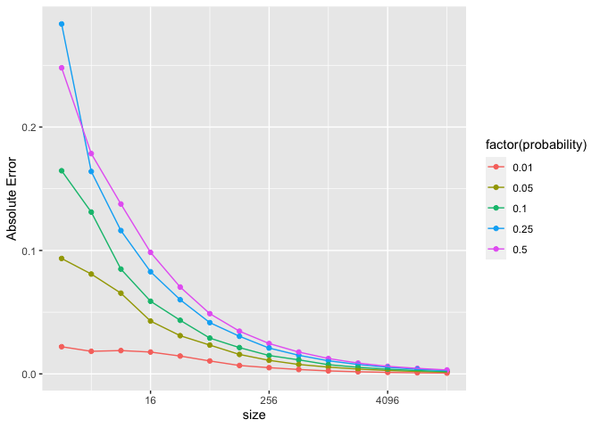
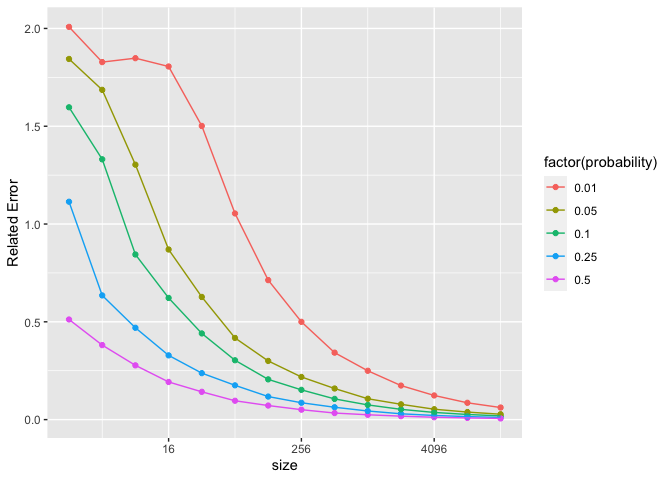

Writeup
================
Zhengqi Tian
9/10/2021

Reference:<https://www.investopedia.com/terms/m/montecarlosimulation.asp>

***Introduction***
<p>
 As data scientist, we use simulation to generate approximate answer,
providing prediction. Monte Carlo simulation is a classic model for the
task. It is a fact is that there is some degree of error in a quantity
estimated. However, we find the degree of error get smaller as the
number of simulation replicates increase. The blog is focusing on the
investigation of the relationship between the number of replicates and
simulation error.
</p>
***Concepts***
<p>

 The basis of a Monte Carlo simulation is that the probability of
varying outcomes cannot be determined by random variable interference.
Thus, the model focuses on constantly repeating random samples to
achieve certain results.

<p>

 We assume that the more simulation replicates, the Himmler the degree
of error between estimated values and True values. For statistics, we
can find the absolute error and relative error, figuring out which one
can be a better error we look for.

***Key Vocabulary Terms and Step***
<p>
 To setup the simulation, The first step is to set several true variable
we trying to observe. For this case, we set five true underlying
probability, as P. The is the detail:
</p>

``` r
probability<-c(0.01, 0.05, 0.10, 0.25, 0.50)
probability
```

    ## [1] 0.01 0.05 0.10 0.25 0.50

<p>
  Second, we need apply some benchmarks to sign the replicate number.
the replicate number allow as to repeated simulation process again and
again,providing the estimated value, which here is estimated probability
based on the true underlying portability. with the code we can have 14
replicated numbers:
</p>

``` r
size<-NULL
  size[1]<-2
  for(i in 2:14)(
  size[i]=size[i-1]*2
 )
  size
```

    ##  [1]     2     4     8    16    32    64   128   256   512  1024  2048  4096
    ## [13]  8192 16384

<p>
  Third, to find the random estimated probability based on the 14 x 5
factorial experiment simulation, we use binomial distribution. Applying
the following code is helpful:
</p>

    rbinom(n, size, prob)

<p>
  In the code X is the number of observations, size is the replicate
number, and the prob is the true underlying probability. To find a more
accurate estimated probability, we want to have a large number of
observation before finding the average meaning of a set of estimate P.
We apply the follow code to find the random estimated p:
</p>

    rbinom(1000, size, probability)

<p>
  Fourth, we need apply the functions of absolute error and relative
erro function to find two types of error. Calculate error as:
</p>

    Absolute Error=|p̂−p|
    and
    Relative error=|p̂−p|/p.

<p>
  Here are simulation R code chunk for errors:
</p>

    Aabsolute Error=mean(abs((rbinom(1000, size, probability) / size) - probability)
    and
    Relative error=mean(abs((rbinom(1000, size, probability) / size) - probability) / probability)

<p>
  Now have got all random error now. Here is the code to show all the
errs based on our factorial experiment we have
</p>

``` r
data<-data.frame(size = rep(size, length(probability)), probability = rep(probability, length(size)), Abs_Error = rep(NA, length(probability) * length(size)),Rel_Error = rep(NA, length(probability) * length(size)))

for (i in 1:nrow(data)) {
  size =data$size[i] 
  probability = data$probability[i]
  Abs=mean(abs((rbinom(1000, size, probability) / size) - probability))
  Rel= mean(abs((rbinom(1000, size, probability) / size) - probability) / probability)
  data[i, "Abs_Error"] = Abs
  data[i, "Rel_Error"] = Rel
}
set.seed(30)
data
```

    ##     size probability    Abs_Error   Rel_Error
    ## 1      2        0.01 0.0220000000 2.008000000
    ## 2      4        0.05 0.0809000000 1.686000000
    ## 3      8        0.10 0.0849000000 0.844250000
    ## 4     16        0.25 0.0827500000 0.328500000
    ## 5     32        0.50 0.0703437500 0.142062500
    ## 6     64        0.01 0.0104737500 1.054062500
    ## 7    128        0.05 0.0157625000 0.299968750
    ## 8    256        0.10 0.0148835938 0.152171875
    ## 9    512        0.25 0.0150781250 0.063156250
    ## 10  1024        0.50 0.0124472656 0.024726563
    ## 11  2048        0.01 0.0017155273 0.174105469
    ## 12  4096        0.05 0.0027841309 0.053131836
    ## 13  8192        0.10 0.0027125977 0.026310059
    ## 14 16384        0.25 0.0026908569 0.010866699
    ## 15     2        0.50 0.2480000000 0.512000000
    ## 16     4        0.01 0.0183000000 1.828000000
    ## 17     8        0.05 0.0654000000 1.303500000
    ## 18    16        0.10 0.0588500000 0.622125000
    ## 19    32        0.25 0.0600937500 0.237625000
    ## 20    64        0.50 0.0487812500 0.096375000
    ## 21   128        0.01 0.0067975000 0.713250000
    ## 22   256        0.05 0.0109671875 0.218062500
    ## 23   512        0.10 0.0113761719 0.105886719
    ## 24  1024        0.25 0.0106181641 0.044078125
    ## 25  2048        0.50 0.0087709961 0.017681641
    ## 26  4096        0.01 0.0012121387 0.123475586
    ## 27  8192        0.05 0.0019912598 0.038561523
    ## 28 16384        0.10 0.0018852295 0.018879272
    ## 29     2        0.25 0.2835000000 1.114000000
    ## 30     4        0.50 0.1785000000 0.381000000
    ## 31     8        0.01 0.0189000000 1.848000000
    ## 32    16        0.05 0.0428000000 0.869750000
    ## 33    32        0.10 0.0434312500 0.440625000
    ## 34    64        0.25 0.0415156250 0.175312500
    ## 35   128        0.50 0.0345781250 0.071921875
    ## 36   256        0.01 0.0050400000 0.499921875
    ## 37   512        0.05 0.0076367188 0.159031250
    ## 38  1024        0.10 0.0074503906 0.075107422
    ## 39  2048        0.25 0.0076557617 0.029738281
    ## 40  4096        0.50 0.0061352539 0.012077148
    ## 41  8192        0.01 0.0008903320 0.085930176
    ## 42 16384        0.05 0.0014304932 0.027547363
    ## 43     2        0.10 0.1646000000 1.597000000
    ## 44     4        0.25 0.1640000000 0.635000000
    ## 45     8        0.50 0.1376250000 0.277500000
    ## 46    16        0.01 0.0176925000 1.805500000
    ## 47    32        0.05 0.0309500000 0.627125000
    ## 48    64        0.10 0.0290000000 0.303468750
    ## 49   128        0.25 0.0304765625 0.117843750
    ## 50   256        0.50 0.0246093750 0.050757812
    ## 51   512        0.01 0.0035683594 0.342343750
    ## 52  1024        0.05 0.0054947266 0.106675781
    ## 53  2048        0.10 0.0053372070 0.052542969
    ## 54  4096        0.25 0.0053247070 0.021242187
    ## 55  8192        0.50 0.0044759521 0.008674561
    ## 56 16384        0.01 0.0006346558 0.061835693
    ## 57     2        0.05 0.0935000000 1.844000000
    ## 58     4        0.10 0.1311000000 1.331000000
    ## 59     8        0.25 0.1161250000 0.469500000
    ## 60    16        0.50 0.0984375000 0.192500000
    ## 61    32        0.01 0.0144600000 1.501500000
    ## 62    64        0.05 0.0233343750 0.417500000
    ## 63   128        0.10 0.0212906250 0.205750000
    ## 64   256        0.25 0.0209218750 0.086234375
    ## 65   512        0.50 0.0176914062 0.033570312
    ## 66  1024        0.01 0.0024127734 0.249652344
    ## 67  2048        0.05 0.0039000977 0.078339844
    ## 68  4096        0.10 0.0037618652 0.036647949
    ## 69  8192        0.25 0.0037824707 0.015443848
    ## 70 16384        0.50 0.0032048340 0.005995850

***Visualization***

<p>

 Now, thank ggplot package for giving us a quick way to visualize the
solutions. We are about have the absolute error figure and the relative
error figure.

<p>

 Here is the Absolute Error:

``` r
require(ggplot2)
```

    ## Loading required package: ggplot2

``` r
ggplot(data, aes(size, Abs_Error, color = factor(probability))) + 
  geom_point() +
  geom_line(aes(group = probability)) + 
  scale_x_continuous(trans = "log2") +
  ylab("Absolute Error")
```

<!-- -->

<p>

 Here is the related error table:

``` r
ggplot(data, aes(size, Rel_Error, color = factor(probability))) + 
  geom_point() +
  geom_line(aes(group = probability)) + 
  scale_x_continuous(trans = "log2") +
  ylab("Related Error")
```

<!-- -->
