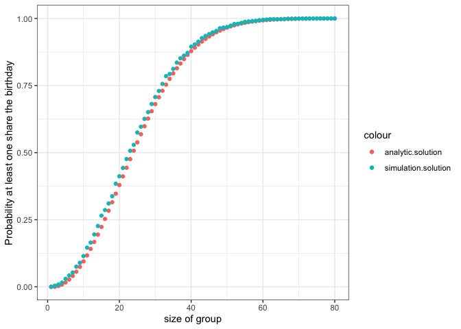

writeup
================

***Introduction*** The blog is post to explain how to solve the birthday
problem with both analytics and simulation tools. Assume that birthdays
are equally likely to fall on any day of the year, ignoring leap year. A
generated graph shows both solution for a range of possible classes, say
1 to 80 as in the figure shell below. Lets explain the detail one by one

***Analytics Solution***
<p>
 To find the probability that at least two students having same
birthday, We can use 1- the porbability of no student having same
birthday. Let start from a small size of class. If there is only one
student in the class, the proability of a student’s birthday, will be
365 or 365, which mean one can have any day in a regular year. Now, if
we have two students, the probability of two unique birthday will be
(365/365)(364/365)\]. If we have three, the probability of three unique
birthday class will be (365/365)(364/365)(363/365). With the idea will
can assume that the prorbability of twenty unique birthday will be
</p>

``` r
factorial(20) * choose(365,20) / (365^20)
```

    ## [1] 0.5885616

<p>
  Thus, the probability of at least two students having a same birthday
will be
</p>

``` r
1-factorial(20) * choose(365,20) / (365^20)
```

    ## [1] 0.4114384

<p>
 With this idea, we are able to calculation the probability of at least
two student having a same birthday as the class size is from 1 to 80.
The following expressions help use find the outcome.
</p>

``` r
#size of group
group.size<-seq(1,80,1)

#at least two students will share a birthday
analytic.solution<-rep(NA,length(group.size))

for(i in 1:length(group.size)){
 analytic.solution[i]= 1-factorial(i-1) * choose(365, (i-1)) / (365^(i-1))
}
analytic.solution
```

    ##  [1] 0.000000000 0.000000000 0.002739726 0.008204166 0.016355912 0.027135574
    ##  [7] 0.040462484 0.056235703 0.074335292 0.094623834 0.116948178 0.141141378
    ## [13] 0.167024789 0.194410275 0.223102512 0.252901320 0.283604005 0.315007665
    ## [19] 0.346911418 0.379118526 0.411438384 0.443688335 0.475695308 0.507297234
    ## [25] 0.538344258 0.568699704 0.598240820 0.626859282 0.654461472 0.680968537
    ## [31] 0.706316243 0.730454634 0.753347528 0.774971854 0.795316865 0.814383239
    ## [37] 0.832182106 0.848734008 0.864067821 0.878219664 0.891231810 0.903151611
    ## [43] 0.914030472 0.923922856 0.932885369 0.940975899 0.948252843 0.954774403
    ## [49] 0.960597973 0.965779609 0.970373580 0.974431993 0.978004509 0.981138113
    ## [55] 0.983876963 0.986262289 0.988332355 0.990122459 0.991664979 0.992989448
    ## [61] 0.994122661 0.995088799 0.995909575 0.996604387 0.997190479 0.997683107
    ## [67] 0.998095705 0.998440043 0.998726391 0.998963666 0.999159576 0.999320753
    ## [73] 0.999452881 0.999560806 0.999648644 0.999719878 0.999777437 0.999823779
    ## [79] 0.999860955 0.999890668

***Simulation Solution***
<p>
 The simulation solution is little different. Lets think step by step.
First, as we know the students can have birthdays in any date. we can
use number 1 to 365 to represent the date, and each student in the class
will have a random number from 1 to 365 as their birthday. Now we are
able to have one class performance under certain classmates’ size.
</p>
<p>

 Second, as we assume one class is one test round, if we test 10000
classes’ performance and 50 class have duplicate birthday, we can use
the ratio to imply the probability of duplicate birthday in the class
based on classmate size./p&gt;

<p>
 The following expressions is based on 10000 tests to find the
probability of at least two students having same birthday in each class
size from 1 to 80.
</p>

``` r
#Simulation
#duplicate birthday class amount
duplicated.class.amount<-function(student.amount=10,test.round=10){
  test.round<-seq(0,test.round,1)
  duplicated.class<-0
  for (i in 1:length(test.round)){
  test.round[i]=any(duplicated(sample(1:365,student.amount,replace = T)))
  if(test.round[i]==1){
    duplicated.class<-as.numeric(duplicated.class+1)
  }
  }
  duplicated.class
  }

#Probability of duplicate birth date in classes
prob.duplicate.birth<-function(duplicated.class.amount,test.round){
  prob<-duplicated.class.amount/test.round
  prob
}

prob.duplicate.birth(duplicated.class.amount(10,1000),1000)
```

    ## [1] 0.111

``` r
#simulation
simulation.solution<-rep(NA,80)
  for(i in 0:length(simulation.solution)){
  simulation.solution[i]=prob.duplicate.birth(duplicated.class.amount(i,10000),10000)
}

simulation.solution
```

    ##  [1] 0.0000 0.0039 0.0083 0.0154 0.0299 0.0425 0.0533 0.0750 0.0896 0.1144
    ## [11] 0.1459 0.1650 0.1953 0.2266 0.2653 0.2861 0.3106 0.3375 0.3841 0.4119
    ## [21] 0.4427 0.4761 0.5070 0.5288 0.5751 0.5966 0.6257 0.6510 0.6813 0.7072
    ## [31] 0.7299 0.7561 0.7851 0.7930 0.8119 0.8354 0.8516 0.8615 0.8715 0.8947
    ## [41] 0.9031 0.9136 0.9266 0.9349 0.9417 0.9481 0.9533 0.9634 0.9661 0.9681
    ## [51] 0.9732 0.9795 0.9802 0.9835 0.9874 0.9887 0.9902 0.9911 0.9935 0.9947
    ## [61] 0.9959 0.9969 0.9972 0.9969 0.9977 0.9977 0.9989 0.9989 0.9991 0.9996
    ## [71] 0.9997 0.9995 0.9997 0.9999 0.9998 0.9997 1.0000 1.0000 0.9998 1.0001

<p>

  Now we are able to have all the data in the data frame. Here is the
data frame

``` r
#data frame
data<-data.frame(group.size,analytic.solution,simulation.solution)
data
```

    ##    group.size analytic.solution simulation.solution
    ## 1           1       0.000000000              0.0000
    ## 2           2       0.000000000              0.0039
    ## 3           3       0.002739726              0.0083
    ## 4           4       0.008204166              0.0154
    ## 5           5       0.016355912              0.0299
    ## 6           6       0.027135574              0.0425
    ## 7           7       0.040462484              0.0533
    ## 8           8       0.056235703              0.0750
    ## 9           9       0.074335292              0.0896
    ## 10         10       0.094623834              0.1144
    ## 11         11       0.116948178              0.1459
    ## 12         12       0.141141378              0.1650
    ## 13         13       0.167024789              0.1953
    ## 14         14       0.194410275              0.2266
    ## 15         15       0.223102512              0.2653
    ## 16         16       0.252901320              0.2861
    ## 17         17       0.283604005              0.3106
    ## 18         18       0.315007665              0.3375
    ## 19         19       0.346911418              0.3841
    ## 20         20       0.379118526              0.4119
    ## 21         21       0.411438384              0.4427
    ## 22         22       0.443688335              0.4761
    ## 23         23       0.475695308              0.5070
    ## 24         24       0.507297234              0.5288
    ## 25         25       0.538344258              0.5751
    ## 26         26       0.568699704              0.5966
    ## 27         27       0.598240820              0.6257
    ## 28         28       0.626859282              0.6510
    ## 29         29       0.654461472              0.6813
    ## 30         30       0.680968537              0.7072
    ## 31         31       0.706316243              0.7299
    ## 32         32       0.730454634              0.7561
    ## 33         33       0.753347528              0.7851
    ## 34         34       0.774971854              0.7930
    ## 35         35       0.795316865              0.8119
    ## 36         36       0.814383239              0.8354
    ## 37         37       0.832182106              0.8516
    ## 38         38       0.848734008              0.8615
    ## 39         39       0.864067821              0.8715
    ## 40         40       0.878219664              0.8947
    ## 41         41       0.891231810              0.9031
    ## 42         42       0.903151611              0.9136
    ## 43         43       0.914030472              0.9266
    ## 44         44       0.923922856              0.9349
    ## 45         45       0.932885369              0.9417
    ## 46         46       0.940975899              0.9481
    ## 47         47       0.948252843              0.9533
    ## 48         48       0.954774403              0.9634
    ## 49         49       0.960597973              0.9661
    ## 50         50       0.965779609              0.9681
    ## 51         51       0.970373580              0.9732
    ## 52         52       0.974431993              0.9795
    ## 53         53       0.978004509              0.9802
    ## 54         54       0.981138113              0.9835
    ## 55         55       0.983876963              0.9874
    ## 56         56       0.986262289              0.9887
    ## 57         57       0.988332355              0.9902
    ## 58         58       0.990122459              0.9911
    ## 59         59       0.991664979              0.9935
    ## 60         60       0.992989448              0.9947
    ## 61         61       0.994122661              0.9959
    ## 62         62       0.995088799              0.9969
    ## 63         63       0.995909575              0.9972
    ## 64         64       0.996604387              0.9969
    ## 65         65       0.997190479              0.9977
    ## 66         66       0.997683107              0.9977
    ## 67         67       0.998095705              0.9989
    ## 68         68       0.998440043              0.9989
    ## 69         69       0.998726391              0.9991
    ## 70         70       0.998963666              0.9996
    ## 71         71       0.999159576              0.9997
    ## 72         72       0.999320753              0.9995
    ## 73         73       0.999452881              0.9997
    ## 74         74       0.999560806              0.9999
    ## 75         75       0.999648644              0.9998
    ## 76         76       0.999719878              0.9997
    ## 77         77       0.999777437              1.0000
    ## 78         78       0.999823779              1.0000
    ## 79         79       0.999860955              0.9998
    ## 80         80       0.999890668              1.0001

<p>

 With the data, we are able to have the grah via ggplot.

``` r
#plot
require(ggplot2)
```

    ## Loading required package: ggplot2

``` r
g<-ggplot(data)+geom_point(aes(y=analytic.solution,x=group.size,color="analytic.solution"))+geom_point(aes(y=simulation.solution,x=group.size,color="simulation.solution"))
g+labs(
  y="Probability at least one share the birthday",
  x="size of group")+
  theme_bw()
```

<!-- -->
***Solution***
<p>

 From the graph, we can find that the larger the size of group, the
higher the probability at least one share the birthday. As the size
achieved 60, the probility is almost approach 1. Both method solutionn
have a closed solution. However, compare with the analytic solution, the
simulation have a lower probility when the size of group is small. Its
may because of the simulation times.
